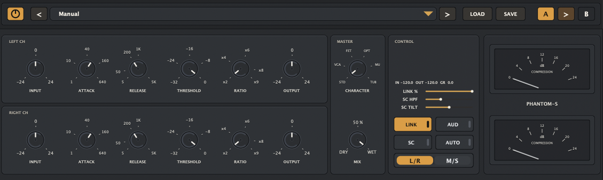

# nComp Build Guide

This repository contains the JUCE version of nComp.

 

The project is configured with CMake and C++17. By default it fetches JUCE from GitHub during configure time.

## Project Layout

- `JUCE/` contains the CMake project.
- `JUCE/Source/` contains the plug-in source code.
- `.vscode/tasks.json` contains a ready-to-run VS Code build task.

## Requirements

### All Platforms

- CMake 3.22 or newer
- A C++17 compiler
- Git
- Internet access for the first configure step when `NCOMP_FETCH_JUCE=ON`

### macOS

- Xcode or Xcode Command Line Tools
- A recent macOS SDK

### Windows

- Visual Studio 2022 with the Desktop development with C++ workload
- MSVC v143 toolset
- Windows 10 or Windows 11 SDK

### Linux

- GCC or Clang with C++17 support
- `make` or Ninja
- Development packages for ALSA, X11, and FreeType

Example packages for Ubuntu or Debian:

```bash
sudo apt update
sudo apt install build-essential cmake ninja-build pkg-config \
  libasound2-dev libjack-jackd2-dev libfreetype6-dev \
  libx11-dev libxext-dev libxinerama-dev libxrandr-dev \
  libxcursor-dev libxcomposite-dev libxrender-dev libglu1-mesa-dev
```

## Build Outputs

- macOS: VST3 and AU
- Windows: VST3
- Linux: VST3

Build artefacts are generated under `JUCE/build/`.

Typical output locations:

- `JUCE/build/nComp_artefacts/VST3/nComp.vst3`
- `JUCE/build/nComp_artefacts/AU/nComp.component` on macOS

`COPY_PLUGIN_AFTER_BUILD` is enabled, so JUCE may also copy the plug-in to the standard local plug-in folders after a successful build.

## macOS Build

From the repository root:

```bash
cmake -S JUCE -B JUCE/build -DCMAKE_BUILD_TYPE=Release
cmake --build JUCE/build -j8
```

To clean and rebuild from scratch:

```bash
rm -rf JUCE/build
cmake -S JUCE -B JUCE/build -DCMAKE_BUILD_TYPE=Release
cmake --build JUCE/build -j8
```

## Windows Build

Open a Developer PowerShell for Visual Studio or a normal PowerShell with Visual Studio in `PATH`, then run:

```powershell
cmake -S JUCE -B JUCE/build -G "Visual Studio 17 2022" -A x64
cmake --build JUCE/build --config Release --parallel
```

To clean and rebuild from scratch:

```powershell
Remove-Item -Recurse -Force JUCE/build
cmake -S JUCE -B JUCE/build -G "Visual Studio 17 2022" -A x64
cmake --build JUCE/build --config Release --parallel
```

If you prefer Ninja on Windows, use a Ninja generator instead of the Visual Studio generator.

## Linux Build

From the repository root:

```bash
cmake -S JUCE -B JUCE/build -DCMAKE_BUILD_TYPE=Release
cmake --build JUCE/build -j8
```

To clean and rebuild from scratch:

```bash
rm -rf JUCE/build
cmake -S JUCE -B JUCE/build -DCMAKE_BUILD_TYPE=Release
cmake --build JUCE/build -j8
```

If you use Ninja:

```bash
cmake -S JUCE -B JUCE/build -G Ninja -DCMAKE_BUILD_TYPE=Release
cmake --build JUCE/build
```

## Optional: Use a System JUCE Installation

The default configuration fetches JUCE automatically:

```bash
-DNCOMP_FETCH_JUCE=ON
```

If you already have JUCE 7 installed and exported as a CMake package, you can disable fetching:

```bash
cmake -S JUCE -B JUCE/build -DNCOMP_FETCH_JUCE=OFF
```

## VS Code Task

The workspace includes a build task:

- `Build nComp JUCE clean`

This task runs a configure step and then builds the JUCE project.

## Offline Analysis Harness

The JUCE project now includes an offline validation target named `nCompAnalysis`.

Build and run it from the repository root:

```bash
cmake -S JUCE -B JUCE/build -DCMAKE_BUILD_TYPE=Release
cmake --build JUCE/build --target nCompAnalysis -j8
./JUCE/build/nCompAnalysis_artefacts/nCompAnalysis --output JUCE/build/ncomp-analysis-report.md
```

The harness prints a Markdown report covering alias-fold stress, THD/THD+N, IMD, release recovery, stereo image stability, automation robustness, sample-rate switching, and CPU headroom.

For the remaining host-level QA matrix, see `docs/validation-and-qa.md`.

## Notes

- The current configuration uses the JUCE `master` branch because older JUCE releases can fail on newer macOS SDKs during `juceaide` setup.
- If a platform-specific plug-in format is not supported, it is not requested in CMake.
- On macOS, if Logic Pro does not pick up a newly built AU immediately, restart Logic and rescan Audio Units.