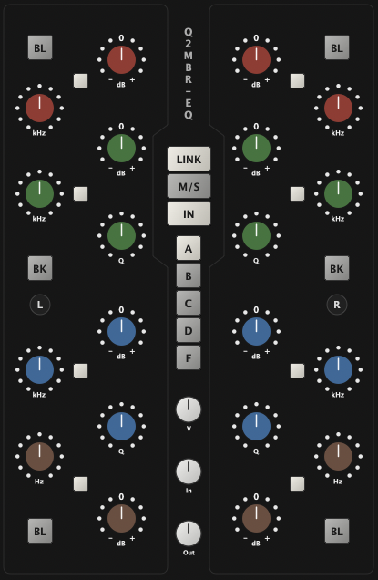

# nEQ

Parametric EQ plugin project with a CMake-based structure aligned with the other modules in this repository.



## Build

Generate LUT, configure and build plugin:

```sh
cd /Volumes/DATA/Coding/nBundle-Audio/nEQ
ruby scripts/generate_coeff_lut.rb

cd JUCE
cmake -S . -B build
cmake --build build --config Release
```

Regenerate only the precomputed coefficient tables (without building):

```sh
cd /Volumes/DATA/Coding/nBundle-Audio/nEQ
ruby scripts/generate_coeff_lut.rb
```

## What Is Implemented

- Four-band analog-style topology with LF, LMF, HMF and HF sections.
- Hardware-informed frequency ranges:
  - LF: 30 Hz to 450 Hz
  - LMF: 200 Hz to 2.5 kHz
  - HMF: 600 Hz to 7 kHz
  - HF: 1.5 kHz to 16 kHz
- HF and LF Bell switches.
  - BLK switch for a more aggressive response curve versus the default mode.
- Procedurally drawn editor panel in code with no bitmap background dependency.
  - Precomputed filter lookup tables generated offline into the generated coefficient header in the source tree.
- Always-on loudness compensation that estimates wideband energy from the active filter stack and applies smoothed makeup gain.
- Zero-latency processing path based on minimum-phase IIR sections.
- Fixed-size editor laid out to match the supplied reference panel.

## Important Constraint

A true linear-phase EQ cannot also be zero-latency in a causal real-time plugin. This implementation chooses zero added latency and therefore uses minimum-phase filters with hardware-style behavior, then keeps perceived level stable with always-on loudness compensation.